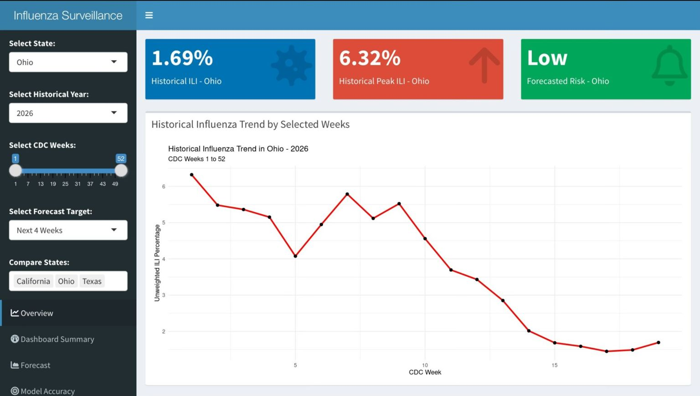
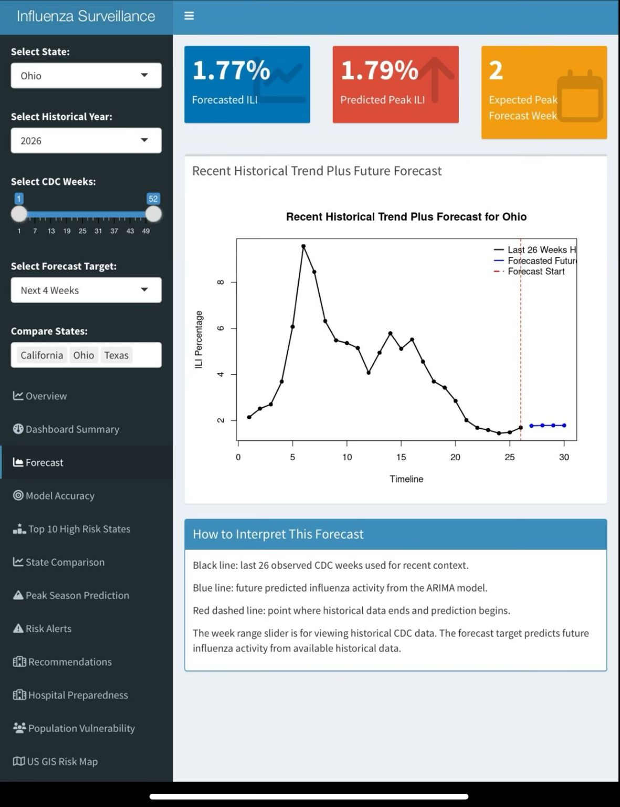
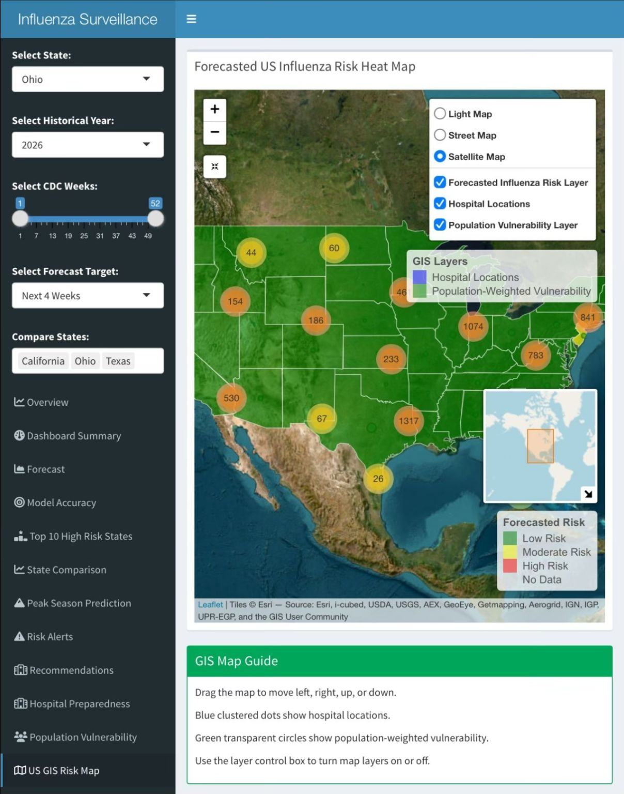

# Influenza Surveillance and Forecasting Dashboard

## Overview

The Influenza Surveillance and Forecasting Dashboard is an interactive public health decision-support tool developed using R Shiny and CDC FluView surveillance data.

The dashboard enables users to monitor influenza activity, explore surveillance trends, identify potential risk levels, and visualize short-term influenza forecasts generated using ARIMA time-series modeling.

## Features

- Interactive influenza surveillance dashboard
- CDC FluView data integration
- ARIMA-based forecasting
- Public health risk classification# Influenza Surveillance and Forecasting Dashboard

## Overview

The Influenza Surveillance and Forecasting Dashboard is an interactive public health intelligence platform developed using R Shiny, CDC FluView surveillance data, and ARIMA time-series forecasting.

The application enables users to monitor influenza-like illness (ILI) activity, explore historical surveillance trends, assess potential risk levels, and visualize short-term influenza forecasts through an interactive and user-friendly dashboard environment.

This project demonstrates the application of epidemiologic methods, surveillance analytics, forecasting techniques, and data visualization to support evidence-informed public health preparedness and decision-making.

---

## Objectives

- Monitor influenza activity using publicly available CDC surveillance data.
- Visualize historical influenza trends across geographic regions.
- Forecast short-term influenza activity using ARIMA models.
- Classify forecasted influenza risk levels.
- Support public health preparedness and situational awareness.

---

## Key Features

### Historical Surveillance Monitoring
- Explore historical influenza-like illness (ILI) trends.
- State-level surveillance visualization.
- Interactive filtering by year and CDC epidemiologic week.

### Forecasting and Risk Assessment
- ARIMA-based forecasting models.
- Short-term influenza activity projections.
- Automated influenza risk classification (Low, Moderate, High).

### Geographic Intelligence
- Interactive GIS-based influenza risk mapping.
- Spatial visualization of influenza burden across states.
- Geographic comparison of surveillance patterns.

### Interactive Dashboard
- User-friendly Shiny interface.
- Dynamic charts and visualizations.
- Real-time exploration of surveillance data.

---

## Data Sources

### CDC FluView
National influenza surveillance data provided by the Centers for Disease Control and Prevention (CDC).

### ILINet (Influenza-like Illness Surveillance Network)
Outpatient influenza surveillance data used to assess influenza activity across the United States.

### NREVSS
National Respiratory and Enteric Virus Surveillance System laboratory testing data.

Data Sources:
- CDC FluView
- ILINet
- NREVSS Clinical Laboratories
- NREVSS Public Health Laboratories

---

## Methods

### Data Management
- Data cleaning and preprocessing in R
- Data integration from multiple CDC surveillance sources

### Statistical Analysis
- Time-series analysis
- ARIMA forecasting
- Historical trend analysis

### Visualization
- Interactive dashboards using R Shiny
- Epidemiologic trend visualization
- GIS-based risk mapping

---

## Technologies Used

- R
- R Shiny
- shinydashboard
- ggplot2
- dplyr
- forecast
- leaflet
- DT

---

## Dashboard Preview

### Overview Dashboard

### Forecast Dashboard

### GIS Risk Map

---

## Live Dashboard

🔗 https://akhilavanga.shinyapps.io/influenza-surveillance-dashboard/

---

## Public Health Applications

This project demonstrates how routine influenza surveillance data can be transformed into actionable public health intelligence through forecasting, visualization, and geographic analysis.

Potential applications include:

- Influenza surveillance monitoring
- Public health preparedness planning
- Situational awareness reporting
- Early warning and risk assessment
- Public health informatics education
- Epidemiologic decision support

---

## Author

### Akhila Vanga, BDS, MS Clinical Epidemiology

- MS Clinical Epidemiology, Kent State University
- Research Intern, Cleveland Clinic Quantitative Health Sciences
- Member, Delta Omega Honorary Society in Public Health
- Clinical Epidemiologist | Biostatistician | Public Health Informatics Enthusiast

---

## Citation

If you reference or build upon this project, please cite:

Vanga A. *Influenza Surveillance and Forecasting Dashboard: An Interactive Public Health Intelligence Platform Using CDC FluView Data, R Shiny, and ARIMA Forecasting.* 2026.

---

## Disclaimer

This project was developed for educational, research, and public health informatics demonstration purposes. Forecasts generated by the dashboard should not be interpreted as official CDC forecasts or used as a substitute for public health guidance.
- Interactive visualizations
- Decision-support for preparedness planning

## Data Source

- CDC FluView
- ILINet Surveillance Data

## Methods

- Data Cleaning and Processing in R
- Time-Series Analysis
- ARIMA Forecasting
- Interactive Dashboard Development using R Shiny

## Technologies

- R
- R Shiny
- shinydashboard
- ggplot2
- forecast
- dplyr

## Live Dashboard

https://akhilavanga.shinyapps.io/influenza-surveillance-dashboard/

## Public Health Applications

This dashboard was developed to demonstrate how routine influenza surveillance data can be transformed into actionable public health intelligence through forecasting and visualization techniques.

## Author

Akhila Vanga, BDS, MS Clinical Epidemiology
Kent State University
